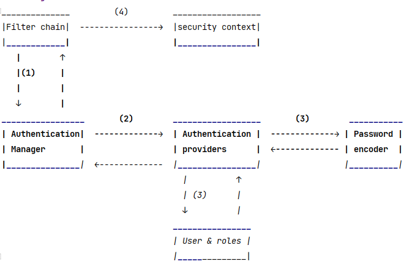

# Getting Started

### first steps

* execute mvn clean, install
* copy and paste environment string in run configuration:
DATASOURCE_URL=jdbc:postgresql://localhost:5432/resource_user;DATASOURCE_PASSWORD=superSecretPassword;DATASOURCE_USER=admin;FLYWAY_USER=admin;FLYWAY_PASSWORD=superSecretPassword;ISSUER_URI=http://localhost:9000;CLIENT=client;CLIENT_SECRET=secret;REDIRECT_URL=http://127.0.0.1:3000/authorized;ALLOWED_ORIGIN=http://127.0.0.1:3000;ALLOWED_HEADER=*;ALLOWED_METHOD=*
* run docker-compose-postgres.yml file
* build project
* open JShell console and generate code challenge and verifier (code in code-challenge-and-verifier.txt)
* in AuthorizationServerConfig Class, replace code challenge and verifier value in predefined urls with your own generated code
* run application

##### provided user 
* Bob@gmail.com
* Password: Hallo Bob 

### Design architecture 
##### How to use the spring security framework

### for more information on this sketch:
* Book: Spring Security in action
* author: Laurentiu Spilca 
* chapter: Hello Spring Security -> 2.2 Which are the default configurations?
* link: https://learning.oreilly.com/library/view/spring-security-in/9781617297731/?ar=

### what is missing 

* clients are currently provided at runtime by the authorization server but 
 must be stored in a database
* the resource server hasn't been finished yet
* unit and integration tests are still missing
* An user interface should be added
* Tokens should associate roles with clients
* more provider for different authentications are needed
for example using second channel of
communication for password forgotten functionality 

                                    